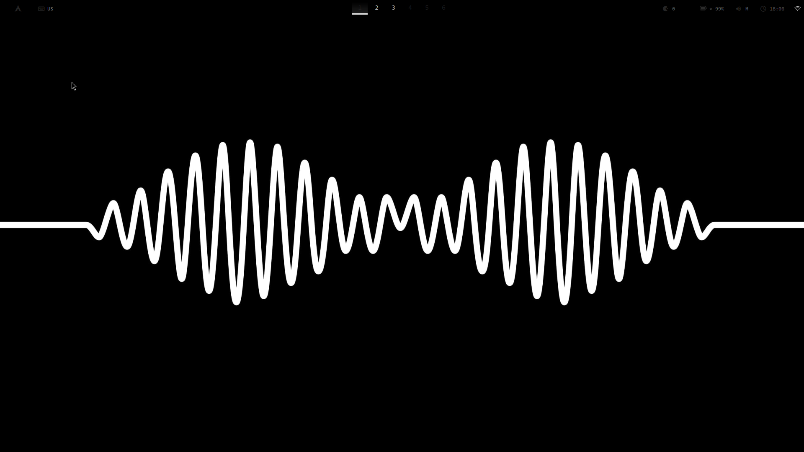
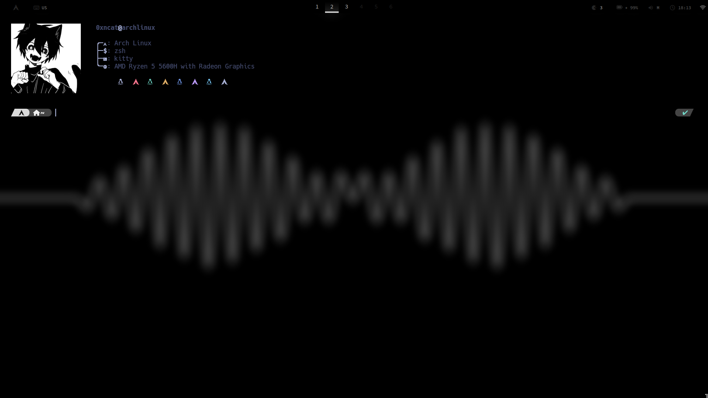

# Q T I L E

My daily driver **Arch Linux** riced with a **Qtile** modified code to make changes easier to apply and more scalable, also, giving my setup a minimal look! 

# -----> T A K E  A  L O O K <-----

## Desktop

## Terminal

